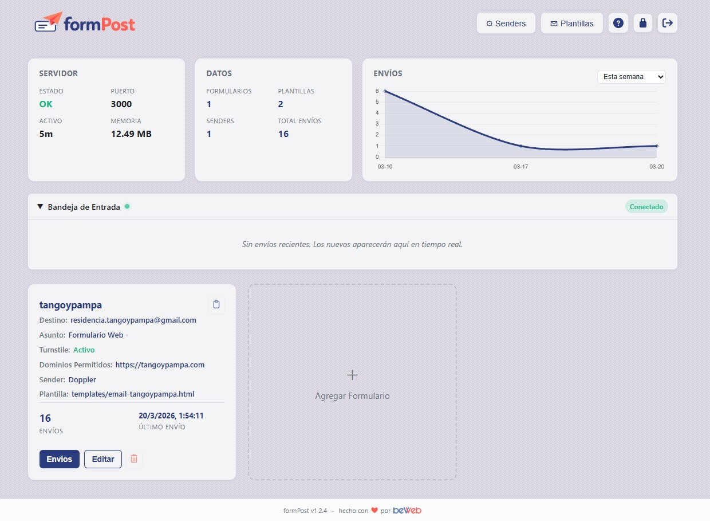

<p align="center">
  
</p>

<p align="center">
  Backend en Node.js listo para producción para procesar formularios de contacto.<br/>
  <strong><a href="README.md">Read in English</a></strong>
</p>

<p align="center">
  
</p>

<p align="center">
  <strong>Sponsor:</strong>&nbsp;
  <a href="https://beweb.com.ar"></a>
</p>

[](https://www.docker.com/)
[](https://nodejs.org/)
[](LICENSE)

## Tabla de Contenidos

- [Características](#características)
- [Inicio Rápido](#inicio-rápido)
- [Configuración](#configuración)
- [Variables de Entorno](#variables-de-entorno)
- [Internacionalización (i18n)](#internacionalización-i18n)
- [Panel de Administración](#panel-de-administración)
- [Plantillas de Email](#plantillas-de-email)
- [Ejemplo de Formulario HTML](#ejemplo-de-formulario-html)
- [Referencia de API](#referencia-de-api)
- [API para Agentes de IA](#api-para-agentes-de-ia)
- [Despliegue con Docker](#despliegue-con-docker)
- [Seguridad](#seguridad)
- [Estructura de Archivos](#estructura-de-archivos)
- [Licencia](#licencia)

## Características

### Core
- **Soporte multi-formulario** - Formularios ilimitados, cada uno con su propia configuración
- **Multi-sender de email** - Múltiples senders (relays SMTP o SendGrid API) con toggle activo/desactivado por sender
- **Soporte SendGrid** - Envío vía la API HTTP v3 de SendGrid con solo una API key y un dominio de envío verificado (no requiere puertos SMTP)
- **API para Agentes** - API REST auto-documentada (`/api/v1`) para que agentes de IA creen cuentas, formularios, senders y plantillas programáticamente
- **Múltiples destinatarios** - Enviar a varias direcciones email por formulario (separados por coma, UI de chips)
- **Notificaciones por email** - Plantillas HTML personalizadas con inyección dinámica de campos
- **Archivos adjuntos** - Recibe archivos (máx 5, 10 MB cada uno) y los reenvía por email, Discord y Telegram
- **Gestión de plantillas** - Crear, editar y eliminar plantillas desde el panel admin
- **Auto-respuesta** - Email de confirmación automático al remitente, con plantilla seleccionable
- **Formularios sin sender** - Los formularios pueden funcionar solo con notificaciones (Discord, Telegram, Webhook) sin sender SMTP

### Notificaciones
- **Discord** - Webhook opcional por formulario para alertas en tiempo real (con archivos adjuntos)
- **Telegram** - Notificaciones via bot con descubrimiento automático del Chat ID mediante botón "Obtener" (con archivos adjuntos)
- **Webhook genérico** - POST con JSON a cualquier URL en cada envío (Slack, Zapier, n8n, backends custom)

### Protección anti-bot
- **Cloudflare Turnstile / hCaptcha** - Captcha por formulario con selección de proveedor y toggle
- **Honeypot** - Campo oculto (`_hp_field`) que rechaza bots silenciosamente
- **Restricción de dominio** - Envíos solo desde dominios autorizados (por formulario)

### Panel de Administración
- **UI completa** - Gestionar formularios, senders, plantillas, estadísticas, envíos y contraseñas
- **Bandeja de entrada** - Feed en vivo de envíos recibidos via SSE
- **Bandeja de salida** - Feed en vivo de mails y notificaciones enviadas con estado (OK, error, omitido)
- **Log de salida** - Modal paginado con el historial completo de mails y notificaciones por formulario
- **Estadísticas y gráficos** - Contadores de envíos, mails y notificaciones con gráfico de áreas superpuestas
- **Búsqueda de envíos** - Buscar por nombre o email
- **Código de integración** - Código HTML listo para copiar en el modal de edición, con honeypot y captcha
- **Backup / restore** - Exportar e importar configuración completa (formularios, senders, plantillas) como JSON
- **Tema oscuro / claro** - Alternancia persistida en localStorage
- **Internacionalización** - Servidor y panel en Inglés y Español vía variable `LANG`

### Almacenamiento y exportación
- **Envíos** - Almacenamiento en JSON, hasta 1000 por formulario
- **Log de salida** - Registro de mails y notificaciones enviadas (hasta 500 por formulario)
- **Exportación** - CSV o JSON

### Seguridad
- **Limitación de tasa** - Límites separados para envíos, API admin e intentos de login
- **Headers de seguridad** - Helmet con CSP, protección XSS
- **Docker ready** - Build multi-etapa, usuario no-root, health checks

## Inicio Rápido

### Docker Compose (recomendado)

```bash
git clone https://github.com/beweb-ar/formPost.git
cd formPost

# Edita config.json con tu configuración SMTP y de formularios, luego:
docker-compose up -d

# Abre http://localhost:3000/admin
# Credenciales por defecto: admin / changeme123
```

### Desarrollo Local

```bash
npm install
npm run dev    # nodemon con auto-recarga
# o
npm start      # node directo
```

## Configuración

Toda la configuración está en `config.json`. El panel admin puede modificar la mayoría en tiempo real.

```json
{
    "recipients": {
        "mi-form": {
            "to": "tu@email.com, equipo@email.com",
            "subjectPrefix": "Formulario - ",
            "redirectUrl": "https://ejemplo.com/gracias",
            "templatePath": "templates/contact-form.html",
            "captchaEnabled": true,
            "captchaProvider": "turnstile",
            "allowedDomains": ["https://ejemplo.com"],
            "senderId": "default",
            "discordWebhook": "https://discord.com/api/webhooks/...",
            "telegramBotToken": "123456:ABC-DEF...",
            "telegramChatId": "-100123456789",
            "webhookUrl": "https://hooks.ejemplo.com/...",
            "autoReplyEnabled": true,
            "autoReplySubject": "Gracias por tu consulta",
            "autoReplyTemplate": "templates/auto-reply.html"
        }
    },
    "senders": {
        "default": {
            "name": "Default",
            "type": "smtp",
            "host": "smtp.ejemplo.com",
            "port": 587,
            "secure": false,
            "active": true,
            "from": "noreply@ejemplo.com",
            "user": "usuario_smtp",
            "pass": "contraseña_smtp"
        },
        "sendgrid": {
            "name": "SendGrid",
            "type": "sendgrid",
            "apiKey": "SG.xxxxxxxx",
            "domain": "ejemplo.com",
            "from": "noreply@ejemplo.com",
            "active": true
        }
    },
    "api": {
        "key": "fp_xxxxxxxx (auto-generada en el primer arranque)",
        "enabled": true
    },
    "captcha": {
        "mi-form": { "secretKey": "0x4AAAAA..." }
    },
    "cors": {
        "allowedOrigins": ["https://ejemplo.com"]
    },
    "admin": {
        "username": "admin",
        "password": "changeme123"
    }
}
```

### Opciones por formulario

| Campo | Tipo | Descripción |
|---|---|---|
| `to` | string | Email(s) destino, separados por coma para múltiples |
| `subjectPrefix` | string | Prefijo del asunto |
| `redirectUrl` | string | URL de redirección tras envío (opcional) |
| `templatePath` | string | Ruta a la plantilla HTML |
| `captchaEnabled` | boolean | Activar/desactivar captcha |
| `captchaProvider` | string | `"turnstile"` o `"hcaptcha"` |
| `allowedDomains` | string[] | Dominios permitidos. Vacío = todos |
| `senderId` | string | ID del sender a usar (default: `"default"`) |
| `discordWebhook` | string | URL webhook Discord (opcional) |
| `telegramBotToken` | string | Token del Bot de Telegram (opcional) |
| `telegramChatId` | string | Chat ID de Telegram (opcional) |
| `webhookUrl` | string | URL webhook genérico - recibe POST con JSON (opcional) |
| `autoReplyEnabled` | boolean | Enviar auto-respuesta al remitente |
| `autoReplySubject` | string | Asunto del email de auto-respuesta |
| `autoReplyTemplate` | string | Plantilla para la auto-respuesta |

### Opciones de sender

| Campo | Tipo | Descripción |
|---|---|---|
| `name` | string | Nombre / alias |
| `type` | string | `"smtp"` (default) o `"sendgrid"` |
| `active` | boolean | Si es `false`, no se envían emails (config se mantiene) |
| `from` | string | Dirección from |
| `host` | string | Solo SMTP: servidor |
| `port` | number | Solo SMTP: puerto (587, 465, etc.) |
| `secure` | boolean | Solo SMTP: usar TLS/SSL |
| `user` | string | Solo SMTP: usuario |
| `pass` | string | Solo SMTP: contraseña |
| `apiKey` | string | Solo SendGrid: API key con permiso **Mail Send** |
| `domain` | string | Solo SendGrid: dominio de envío verificado (el `from` debe pertenecer a él) |

> **SendGrid:** creá una API key en SendGrid > Settings > API Keys con permiso Mail Send, y verificá tu dominio de envío en Settings > Sender Authentication. Los senders SendGrid usan la API HTTP v3, por lo que funcionan incluso donde los puertos SMTP salientes están bloqueados.

## Variables de Entorno

| Variable | Default | Descripción |
|---|---|---|
| `PORT` | `3000` | Puerto del servidor |
| `DEBUG` | `false` | Omite verificación captcha |
| `LANG` | `es` | Idioma (`en` o `es`) |
| `ADMIN_USERNAME` | - | Crea/actualiza un usuario superadmin con este nombre |
| `ADMIN_PASSWORD` | - | Contraseña del superadmin de `ADMIN_USERNAME` |
| `API_KEY` | - | Sobreescribe la clave maestra de la API para agentes (`/api/v1`, sin restricción) |
| `ENCRYPTION_KEY` | auto | 64 caracteres hex (32 bytes) para cifrar los secretos guardados (contraseñas SMTP, keys de SendGrid, tokens de Telegram, claves de captcha). Si no se define, se genera una clave en `data/.secret.key` — **hacé backup de ese archivo**: sin él no se pueden recuperar los secretos cifrados |

## Cuentas, Usuarios y Roles (v1.4)

formPost es multi-cuenta. Los datos (formularios, senders, plantillas, bandejas, estadísticas) están separados por **cuenta**:

- **superadmin** — ve y gestiona todo: cuentas, usuarios, senders globales, plantillas compartidas, backup/restore, la clave maestra y las API keys de todas las cuentas. Las instalaciones existentes migran solas: el admin anterior pasa a ser superadmin y los formularios existentes quedan en la cuenta `default`.
- **admin** (admin de cuenta) — gestión completa de los formularios, senders, plantillas y datos de su propia cuenta. No puede crear cuentas ni usuarios.
- **usuario** — solo lectura dentro de la cuenta: ve bandejas de entrada/salida y envíos, y puede ver/editar las plantillas de la cuenta. No puede crear ni modificar formularios ni senders.

**Senders globales**: un sender sin cuenta es *global* — todas las cuentas pueden usarlo en sus formularios, pero solo un superadmin puede editarlo. Los senders existentes migran como globales.

**Plantillas compartidas**: los archivos en la raíz de `templates/` se comparten con todas las cuentas (solo lectura para ellas); las plantillas de cada cuenta viven en `templates/<accountId>/`. Si una cuenta edita una compartida, se crea automáticamente una copia propia de la cuenta.

**API keys de agentes por cuenta**: cada cuenta tiene su propia clave de `/api/v1`, estrictamente limitada a sus datos — un agente configurado con la clave de una cuenta no puede leer ni tocar nada de otra. La clave maestra (visible para superadmins) mantiene acceso sin restricción.

**Adjuntos**: los archivos subidos se guardan en `data/attachments/<formId>/<submissionId>/`, aparecen en cada envío y se pueden descargar desde el panel y desde `/api/v1`. Se eliminan junto con su envío.

**Secretos cifrados**: las contraseñas SMTP, API keys de SendGrid, tokens de Telegram y claves de captcha se cifran (AES-256-GCM) dentro de `config.json` y ninguna API los devuelve una vez guardados. Los backups mantienen los secretos cifrados — restaurar en otro servidor requiere la misma `ENCRYPTION_KEY` / `data/.secret.key`.

## Panel de Administración

**URL:** `http://localhost:3000/admin`

### Dashboard
- **Barra de estado** - Estado, puerto, uptime, memoria, envíos, mails, notificaciones
- **Tarjetas** - Destino, asunto, captcha, dominios, sender, Discord, Telegram, webhook, auto-respuesta, stats
- **Bandeja de entrada** (izquierda) - Envíos recibidos en tiempo real
- **Bandeja de salida** (derecha) - Mails y notificaciones enviadas con estado
- **Gráfico** - Áreas superpuestas de envíos, mails y notificaciones

### Gestión de Formularios
- CRUD completo con múltiples destinatarios (chips)
- Captcha (Turnstile / hCaptcha), Discord, Telegram, webhook
- Auto-respuesta con selección de plantilla
- Sección de integración con código HTML copiable
- Backup y restore desde el modal de Senders

### Envíos
- Tabla paginada (10 por página) con búsqueda por nombre/email
- Detalle, exportar CSV/JSON, eliminar todo

### Log de Salida
- Click en items del outbox abre modal con log paginado completo
- Fecha, canal (Mail/Discord/Telegram), destino, asunto, estado (OK/Error/Omitido)

### Configuración

El modal de configuración está dividido en pestañas: **Senders**, **Cuentas** y **Usuarios** (solo superadmin) y **API para Agentes**.

- CRUD de senders (SMTP o SendGrid) con toggle activo/desactivado
- Test de conexión
- Gestión de la clave de la API para agentes: ver, copiar, regenerar, habilitar/deshabilitar
- Copiar prompt de integración: un párrafo listo para pegarle a un agente de IA para que integre los formularios del sitio vía `/api/v1`
- Backup / Restore (exporta formularios, senders, plantillas)

## Plantillas de Email

```html
<!-- Modo dinámico -->
<h2>Nuevo envío de {{form_id}}</h2>
<ul>{{fields}}</ul>
```

> Tanto `{{form_id}}` como `{{website_id}}` son soportados por compatibilidad.

Incluye plantilla de auto-respuesta: `templates/auto-reply.html`

## Ejemplo de Formulario HTML

```html
<form action="https://tu-servidor.com/submit" method="POST" enctype="multipart/form-data">
    <input type="hidden" name="form_id" value="mi-form">
    <input type="text" name="_hp_field" style="display:none" tabindex="-1" autocomplete="off">

    <label>Nombre: <input type="text" name="nombre" required></label>
    <label>Email: <input type="email" name="email" required></label>
    <label>Teléfono: <input type="tel" name="telefono"></label>
    <label>Mensaje: <textarea name="mensaje"></textarea></label>

    <!-- Archivos adjuntos (opcional, máx 5 archivos, 10 MB cada uno) -->
    <label>Adjuntos: <input type="file" name="attachments" multiple></label>

    <div class="cf-turnstile" data-sitekey="TU_SITE_KEY"></div>
    <button type="submit">Enviar</button>
</form>
<script src="https://challenges.cloudflare.com/turnstile/v0/api.js" async defer></script>
```

> El campo `website_id` sigue siendo aceptado por compatibilidad, pero se recomienda usar `form_id`.

## API para Agentes de IA

formPost suele ser el backend de sitios construidos por agentes de IA. La **API para Agentes** permite que el propio agente se conecte a tu instancia de formPost y configure todo lo que necesita — formularios, senders de email (SMTP o SendGrid), plantillas — y lea los envíos recibidos y el log de entregas, sin tocar el panel admin.

**Todo lo que el agente necesita saber:**

1. **URL base:** `https://tu-servidor.com/api/v1`
2. **Auto-documentación:** `GET /api/v1` (sin auth) devuelve una especificación JSON legible por máquina de cada endpoint, cada campo y el contrato de `/submit`. Un agente puede arrancar desde esa única URL.
3. **Autenticación:** enviar la clave en el header `X-API-Key` (o `Authorization: Bearer <clave>`). La clave se auto-genera en el primer arranque; el admin puede verla/copiarla/regenerarla en el panel bajo **Configuración > API para Agentes**, o definirla con la variable de entorno `API_KEY`.
4. **Cuentas:** `GET /api/v1/accounts` le dice al agente si ya existe la cuenta de esa integración. Con la clave maestra puede crear una nueva con `POST /api/v1/accounts` y recibir la clave propia de esa cuenta; una clave de cuenta ya está atada a su cuenta y no puede crear otras.

> Sugerencia de prompt para tu agente de IA:
> *"Podés crear el backend de este formulario de contacto en mi instancia de formPost. Hacé un GET a `https://tu-servidor.com/api/v1` para aprender la API; autenticate con el header `X-API-Key: fp_xxx`. Creá un formulario y usá el `exampleHtml` de la respuesta en el sitio web."*

El panel escribe ese prompt por vos: **Configuración > API para Agentes > Copiar prompt de integración** copia un párrafo completo de instrucciones con la URL de este servidor y tu clave ya incluidas, incluyendo la verificación de la cuenta y el paso de creación de cuenta.

### Endpoints

| Método | Endpoint | Descripción |
|---|---|---|
| `GET` | `/api/v1` | Especificación de la API (pública, sin auth, sin secretos) |
| `GET` | `/api/v1/status` | Versión, formularios y senders configurados |
| `GET` | `/api/v1/accounts` | Lista las cuentas visibles para la clave (una clave de cuenta solo ve la propia), con sus formularios y senders |
| `POST` | `/api/v1/accounts` | Crea una cuenta — solo con la clave maestra. Body: `{ "id", "name" }`. Devuelve una única vez la `apiKey` de la nueva cuenta |
| `GET` | `/api/v1/forms` | Lista todos los formularios con su configuración completa |
| `POST` | `/api/v1/forms` | Crea un formulario. Body: `{ "id", ...formConfig }` |
| `GET` | `/api/v1/forms/:id` | Obtiene un formulario |
| `PUT` | `/api/v1/forms/:id` | Actualiza un formulario (body parcial, se mergea) |
| `DELETE` | `/api/v1/forms/:id` | Elimina un formulario |
| `GET` | `/api/v1/forms/:id/submissions` | Lee los envíos recibidos (`?page=1&limit=50`) |
| `GET` | `/api/v1/forms/:id/outbox` | Log de entregas (emails/notificaciones con estado ok/error) |
| `GET` | `/api/v1/senders` | Lista senders (secretos enmascarados) |
| `POST` | `/api/v1/senders` | Crea un sender (SMTP o SendGrid). Body: `{ "id", ...senderConfig }` |
| `PUT` | `/api/v1/senders/:id` | Actualiza un sender (omití `pass`/`apiKey` para conservar los secretos) |
| `DELETE` | `/api/v1/senders/:id` | Elimina un sender |
| `POST` | `/api/v1/senders/:id/test` | Verifica conexión + envía email de prueba. Body: `{ "to" }` (opcional) |
| `GET` | `/api/v1/templates` | Lista plantillas de email |
| `GET` | `/api/v1/templates/:name` | Obtiene el contenido de una plantilla |
| `PUT` | `/api/v1/templates/:name` | Crea/actualiza una plantilla. Body: `{ "content": "<html>..." }` |

Los esquemas de formulario y sender son los mismos de [Configuración](#configuración) (ver `formConfig` y `senderConfig` en la respuesta de `GET /api/v1`). Facilidades al crear formularios:

- `to` es el único campo requerido además de `id`; se aplican defaults razonables (`subjectPrefix`, `templatePath`, captcha desactivado, todos los orígenes permitidos).
- Se puede incluir `captchaSecretKey` (solo escritura) para configurar la verificación captcha en una sola llamada.
- La respuesta de creación incluye `submitUrl` y un `exampleHtml` listo para pegar en el sitio.
- Los errores de validación vuelven como mensajes descriptivos accionables por el agente, más `warnings` para problemas no fatales (ej. un `senderId` que todavía no existe).

### Ejemplo: flujo completo de un agente

```bash
BASE="https://tu-servidor.com"
KEY="fp_xxxxxxxxxxxxxxxx"

# 0. Descubrir la API (sin auth)
curl "$BASE/api/v1"

# 0b. Verificar la cuenta de esta integración (con la clave maestra, crearla si no existe)
curl -H "X-API-Key: $KEY" "$BASE/api/v1/accounts"
curl -X POST "$BASE/api/v1/accounts" \
  -H "X-API-Key: $KEY" -H "Content-Type: application/json" \
  -d '{ "id": "acme", "name": "ACME Inc" }'
# -> devuelve "apiKey": la clave propia de esa cuenta (se muestra una sola vez)

# 1. Crear un sender SendGrid (u omitir si GET /api/v1/senders ya muestra uno)
curl -X POST "$BASE/api/v1/senders" \
  -H "X-API-Key: $KEY" -H "Content-Type: application/json" \
  -d '{
    "id": "sendgrid-main",
    "type": "sendgrid",
    "name": "SendGrid",
    "apiKey": "SG.xxxxxxxx",
    "domain": "ejemplo.com",
    "from": "noreply@ejemplo.com"
  }'

# 2. Probarlo
curl -X POST "$BASE/api/v1/senders/sendgrid-main/test" \
  -H "X-API-Key: $KEY" -H "Content-Type: application/json" \
  -d '{ "to": "yo@ejemplo.com" }'

# 3. Crear el formulario
curl -X POST "$BASE/api/v1/forms" \
  -H "X-API-Key: $KEY" -H "Content-Type: application/json" \
  -d '{
    "id": "contacto-landing",
    "to": "dueno@ejemplo.com",
    "subjectPrefix": "[Landing] ",
    "senderId": "sendgrid-main",
    "allowedDomains": ["https://ejemplo.com"],
    "autoReplyEnabled": true,
    "autoReplySubject": "¡Gracias! Recibimos tu mensaje"
  }'
# -> la respuesta incluye "exampleHtml": un <form> funcional listo para pegar

# 4. Después: leer los envíos y verificar las entregas
curl -H "X-API-Key: $KEY" "$BASE/api/v1/forms/contacto-landing/submissions?limit=10"
curl -H "X-API-Key: $KEY" "$BASE/api/v1/forms/contacto-landing/outbox"
```

### Límites y seguridad

- API para agentes: 240 requests/minuto.
- La clave otorga acceso de configuración a nivel admin — tratala como una contraseña. Regenerala cuando quieras desde el panel.
- La API se puede deshabilitar por completo con el toggle **Habilitada** en **Configuración > API para Agentes** (las requests reciben `503`).
- Los secretos (`pass`, `apiKey`) son de solo escritura: nunca se devuelven en los `GET`.

## Seguridad

| Ámbito | Límite |
|---|---|
| Envíos | 5 por minuto por IP |
| Global por form | 100 por minuto |
| API admin | 30 por minuto por IP |
| Login | 20 por 7 minutos (solo fallos) |
| Archivos adjuntos | Máx 5 archivos, 10 MB cada uno |
| Tipos bloqueados | `.exe`, `.bat`, `.cmd`, `.sh`, `.ps1`, `.msi`, `.dll`, `.com`, `.scr`, `.pif`, `.vbs`, `.js`, `.jar`, `.cpl`, `.inf`, `.reg` |

## Estructura de Archivos

```
formPost/
├── server.js                       # Aplicación principal
├── config.json                     # Configuración
├── admin/
│   └── index.html                  # Panel admin (SPA)
├── templates/
│   ├── contact-form.html           # Plantilla email por defecto
│   └── auto-reply.html             # Plantilla auto-respuesta
└── data/
    ├── submissions-{formId}.json   # Envíos almacenados
    └── outbox-{formId}.json        # Log de mails/notificaciones
```

## Licencia

ISC
