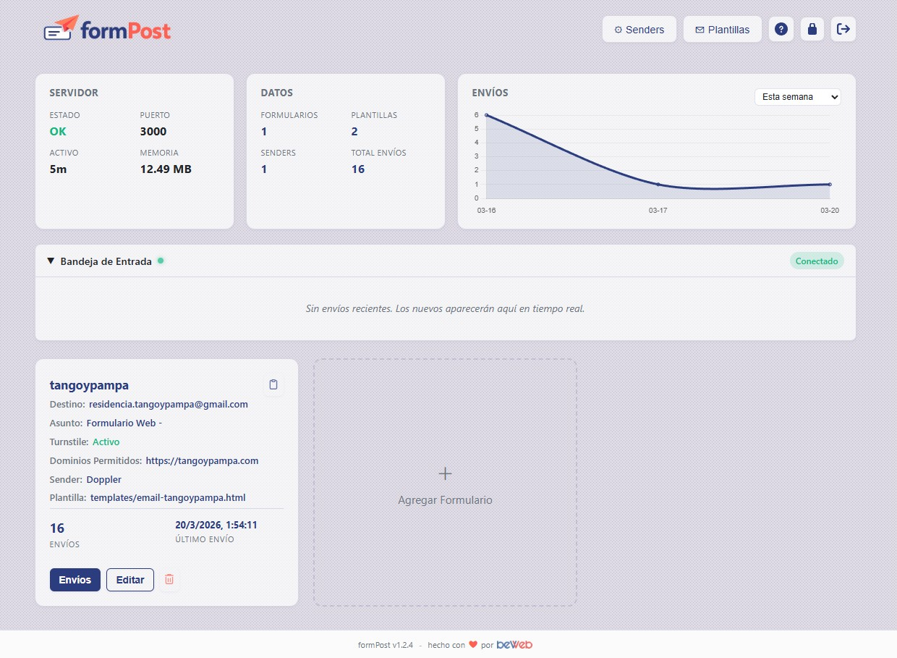

<p align="center">
  
</p>

<p align="center">
  A production-ready Node.js backend for processing contact form submissions.<br/>
  <strong><a href="README.es.md">Leer en Español</a></strong>
</p>

<p align="center">
  
</p>

<p align="center">
  <strong>Sponsor:</strong>&nbsp;
  <a href="https://beweb.com.ar"></a>
</p>

[](https://www.docker.com/)
[](https://nodejs.org/)
[](LICENSE)

## Table of Contents

- [Features](#features)
- [Quick Start](#quick-start)
- [Configuration](#configuration)
- [Environment Variables](#environment-variables)
- [Internationalization (i18n)](#internationalization-i18n)
- [Admin Interface](#admin-interface)
- [Email Templates](#email-templates)
- [HTML Form Example](#html-form-example)
- [API Reference](#api-reference)
- [Docker Deployment](#docker-deployment)
- [Security](#security)
- [File Structure](#file-structure)
- [Troubleshooting](#troubleshooting)
- [License](#license)

## Features

### Core
- **Multi-form support** - Handle unlimited forms, each with its own configuration
- **Multi-sender SMTP** - Configure multiple SMTP relays with active/disabled toggle per sender
- **Multiple recipients** - Send to multiple email addresses per form (comma-separated, chip UI)
- **HTML email notifications** - Custom email templates per form with dynamic field injection
- **Template management** - Create, edit, and delete email templates from the admin UI
- **Auto-responder** - Automatic confirmation email to the person who submitted the form, with selectable template
- **Forms without sender** - Forms can work with notifications only (Discord, Telegram, Webhook) without an SMTP sender

### Notifications
- **Discord notifications** - Optional per-form Discord webhook for real-time submission alerts
- **Telegram notifications** - Per-form Telegram bot notifications with automatic Chat ID discovery via "Fetch" button
- **Generic webhook** - POST JSON payload to any URL on each submission (Slack, Zapier, n8n, custom backends)

### Bot Protection
- **Cloudflare Turnstile / hCaptcha** - Per-form captcha with provider selection and enable/disable toggle
- **Honeypot protection** - Hidden field (`_hp_field`) silently rejects bots without user friction
- **Domain restriction** - Allow submissions only from authorized domains (per form)

### Admin Dashboard
- **Full web UI** - Manage forms, senders, templates, statistics, submissions, and passwords
- **Real-time inbox** - SSE-powered live feed of new submissions
- **Real-time outbox** - Live feed of sent emails, Discord, and Telegram notifications with status (OK, error, skipped)
- **Outbox log modal** - Paginated full log of all outgoing mails and notifications per form
- **Statistics & charts** - Per-form and global counts for submissions, mails, and notifications with time-series chart (overlapping areas)
- **Submission search** - Search submissions by name or email
- **Integration code** - Ready-to-copy HTML form code in the edit modal, including honeypot and captcha
- **Backup / restore** - Export and import full configuration (forms, senders, templates) as JSON
- **Dark / Light theme** - Toggle in admin UI, persisted in localStorage
- **Internationalization** - Server and admin UI in English and Spanish via `LANG` env var

### Storage & Export
- **Submission storage** - JSON file-based storage, up to 1000 submissions per form
- **Outbox storage** - JSON file-based log of all outgoing mails and notifications (up to 500 per form)
- **Export** - Download submissions as CSV or JSON

### Security
- **Rate limiting** - Separate limits for form submissions, per-form global limits, admin API, and login attempts
- **Security headers** - Helmet middleware with CSP, XSS protection
- **Docker ready** - Multi-stage build, non-root user, health checks, resource limits

## Quick Start

### Docker Compose (recommended)

```bash
git clone https://github.com/beweb-ar/formPost.git
cd formPost

# Edit config.json with your SMTP and form settings, then:
docker-compose up -d

# Open http://localhost:3000/admin
# Default credentials: admin / changeme123
```

### Local Development

```bash
npm install
npm run dev    # nodemon with auto-reload
# or
npm start      # plain node
```

The admin interface is available at `http://localhost:3000/admin`.

## Configuration

All settings live in `config.json`. The admin UI can modify most of them at runtime.

```json
{
    "recipients": {
        "my-form": {
            "to": "you@example.com, team@example.com",
            "subjectPrefix": "Contact Form - ",
            "redirectUrl": "https://example.com/thanks",
            "templatePath": "templates/contact-form.html",
            "captchaEnabled": true,
            "captchaProvider": "turnstile",
            "allowedDomains": ["https://example.com"],
            "senderId": "default",
            "discordWebhook": "https://discord.com/api/webhooks/...",
            "telegramBotToken": "123456:ABC-DEF...",
            "telegramChatId": "-100123456789",
            "webhookUrl": "https://hooks.example.com/...",
            "autoReplyEnabled": true,
            "autoReplySubject": "Thank you for your submission",
            "autoReplyTemplate": "templates/auto-reply.html"
        }
    },
    "senders": {
        "default": {
            "name": "Default",
            "host": "smtp.example.com",
            "port": 587,
            "secure": false,
            "active": true,
            "from": "noreply@example.com",
            "user": "smtp_user",
            "pass": "smtp_pass"
        }
    },
    "captcha": {
        "my-form": {
            "secretKey": "0x4AAAAA..."
        }
    },
    "cors": {
        "allowedOrigins": ["https://example.com"]
    },
    "admin": {
        "username": "admin",
        "password": "changeme123"
    }
}
```

### Per-form options

| Field | Type | Description |
|---|---|---|
| `to` | string | Destination email(s), comma-separated for multiple recipients |
| `subjectPrefix` | string | Email subject prefix |
| `redirectUrl` | string | URL to redirect after successful submission (optional) |
| `templatePath` | string | Path to email template HTML file |
| `captchaEnabled` | boolean | Enable/disable captcha verification |
| `captchaProvider` | string | `"turnstile"` or `"hcaptcha"` |
| `allowedDomains` | string[] | Allowed origin domains. Empty = allow all |
| `senderId` | string | ID of the sender to use (default: `"default"`) |
| `discordWebhook` | string | Discord webhook URL (optional) |
| `telegramBotToken` | string | Telegram Bot API token (optional) |
| `telegramChatId` | string | Telegram chat/group/channel ID (optional) |
| `webhookUrl` | string | Generic webhook URL - receives POST with JSON (optional) |
| `autoReplyEnabled` | boolean | Send auto-reply to the submitter's email |
| `autoReplySubject` | string | Subject for the auto-reply email |
| `autoReplyTemplate` | string | Template path for the auto-reply email |

### Sender options

| Field | Type | Description |
|---|---|---|
| `name` | string | Display name / alias |
| `host` | string | SMTP server hostname |
| `port` | number | SMTP port (587, 465, etc.) |
| `secure` | boolean | Use TLS/SSL |
| `active` | boolean | When `false`, emails are skipped (config preserved) |
| `from` | string | From email address |
| `user` | string | SMTP username |
| `pass` | string | SMTP password |

## Environment Variables

| Variable | Default | Description |
|---|---|---|
| `PORT` | `3000` | Server listen port |
| `DEBUG` | `false` | When `true`, skips captcha verification |
| `LANG` | `es` | UI and server language (`en` or `es`) |
| `ADMIN_USERNAME` | - | Override admin username |
| `ADMIN_PASSWORD` | - | Override admin password |

## Internationalization (i18n)

The application supports **English** (`en`) and **Spanish** (`es`). All labels, buttons, stat cards, chart filters, and messages are translated.

```yaml
environment:
  - LANG=es   # Spanish (default)
  - LANG=en   # English
```

## Admin Interface

**URL:** `http://localhost:3000/admin`

### Dashboard

- **Status bar** - Server status, port, uptime, memory, submissions, mails, notifications
- **Form cards** - Destination, subject, captcha, domains, sender, Discord, Telegram, webhook, auto-reply status, per-form stats (submissions, mails, notifications)
- **Real-time inbox** (left) - Live feed of incoming submissions via SSE
- **Real-time outbox** (right) - Live feed of outgoing mails and notifications with status
- **Charts** - Overlapping area chart with submissions, mails, and notifications series
- **Dark/Light theme** toggle

### Form Management

- Add, edit, and delete forms with full configuration
- Multiple recipients with chip/tag UI
- Captcha provider selection (Turnstile / hCaptcha)
- Discord, Telegram, and webhook configuration
- Auto-responder with template selection
- Integration code section with copy-to-clipboard
- Backup and restore from the Senders modal

### Submissions

- Paginated table (10 per page) with search by name/email
- Click any row for full detail
- Export CSV / JSON, delete all

### Outbox Log

- Click any outbox entry to open paginated log modal
- Shows: date, channel (Mail/Discord/Telegram), destination, subject, status (OK/Error/Skipped)

### Senders

- Add, edit, delete SMTP senders with active/disabled toggle
- Test connection from the UI
- Backup / Restore buttons (exports forms, senders, templates as JSON)

## Email Templates

Templates are HTML files with placeholders:

```html
<!-- Dynamic mode (recommended) -->
<h2>New submission from {{website_id}}</h2>
<ul>{{fields}}</ul>

<!-- Legacy mode -->
<p><strong>Name:</strong> {{name}}</p>
```

An auto-reply template (`templates/auto-reply.html`) is included for the auto-responder feature.

## HTML Form Example

```html
<form action="https://your-server.com/submit" method="POST">
    <input type="hidden" name="website_id" value="my-form">

    <!-- Honeypot anti-spam (hidden, do not remove) -->
    <input type="text" name="_hp_field" style="display:none" tabindex="-1" autocomplete="off">

    <label>Name: <input type="text" name="name" required></label>
    <label>Email: <input type="email" name="email" required></label>
    <label>Phone: <input type="tel" name="phone"></label>
    <label>Message: <textarea name="message"></textarea></label>

    <!-- Captcha (if configured) -->
    <div class="cf-turnstile" data-sitekey="YOUR_SITE_KEY"></div>
    <!-- or: <div class="h-captcha" data-sitekey="YOUR_SITE_KEY"></div> -->

    <button type="submit">Send</button>
</form>
<script src="https://challenges.cloudflare.com/turnstile/v0/api.js" async defer></script>
```

## API Reference

### Public

| Method | Endpoint | Description |
|---|---|---|
| `POST` | `/submit` | Process a form submission |
| `GET` | `/health` | Health check |

### Admin (Basic Auth)

| Method | Endpoint | Description |
|---|---|---|
| `GET` | `/admin/api/status` | Server status, totals for submissions/mails/notifications |
| `GET/POST/PUT/DELETE` | `/admin/api/websites[/:id]` | CRUD forms |
| `GET/POST/PUT/DELETE` | `/admin/api/senders[/:id]` | CRUD senders |
| `POST` | `/admin/api/senders/:id/test` | Test sender connection |
| `POST` | `/admin/api/telegram/chats` | Fetch available Telegram chats for a bot token |
| `GET/PUT/DELETE` | `/admin/api/templates[/:name]` | CRUD templates |
| `GET` | `/admin/api/statistics[/:id]` | Stats (includes mails/notifications counts) |
| `GET` | `/admin/api/statistics/chart` | Chart data with submissions, mails, notifications per day |
| `PUT` | `/admin/api/statistics/:id/reset` | Reset stats |
| `GET` | `/admin/api/submissions/:id` | Paginated submissions (`?page=1&limit=10&q=search`) |
| `DELETE` | `/admin/api/submissions/:id` | Delete all submissions |
| `GET` | `/admin/api/submissions/:id/export` | Export (`?format=json\|csv`) |
| `GET` | `/admin/api/outbox/recent` | Recent outbox entries |
| `GET` | `/admin/api/outbox/:id` | Paginated outbox log per form |
| `GET` | `/admin/api/backup` | Download full backup (JSON) |
| `POST` | `/admin/api/restore` | Restore from backup |
| `POST` | `/admin/api/inbox/token` | Issue SSE token |
| `GET` | `/admin/api/inbox/stream` | SSE stream (inbox + outbox events) |

## Docker Deployment

```bash
docker-compose up -d       # Start
docker-compose logs -f     # View logs
docker-compose down        # Stop
```

### Docker features

- **Multi-stage build** - Final image ~150MB
- **Non-root user** - Runs as `nodeuser` (UID 1001)
- **Health check** - `/health` every 30s
- **Resource limits** - 512MB max, 128MB reserved
- **Volumes** - `config.json`, `data/`, `templates/`

## Security

| Scope | Limit |
|---|---|
| Form submissions | 5 per minute per IP |
| Per-form global | 100 per minute per form |
| Admin API | 30 per minute per IP |
| Login attempts | 20 per 7 minutes (failures only) |

## File Structure

```
formPost/
├── server.js                       # Main application
├── config.json                     # Configuration
├── package.json
├── Dockerfile / docker-compose.yml
├── admin/
│   └── index.html                  # Admin dashboard (single-file SPA)
├── templates/
│   ├── contact-form.html           # Default email template
│   └── auto-reply.html             # Auto-responder template
└── data/
    ├── submissions-{formId}.json   # Stored submissions
    └── outbox-{formId}.json        # Outgoing mail/notification log
```

## License

ISC
